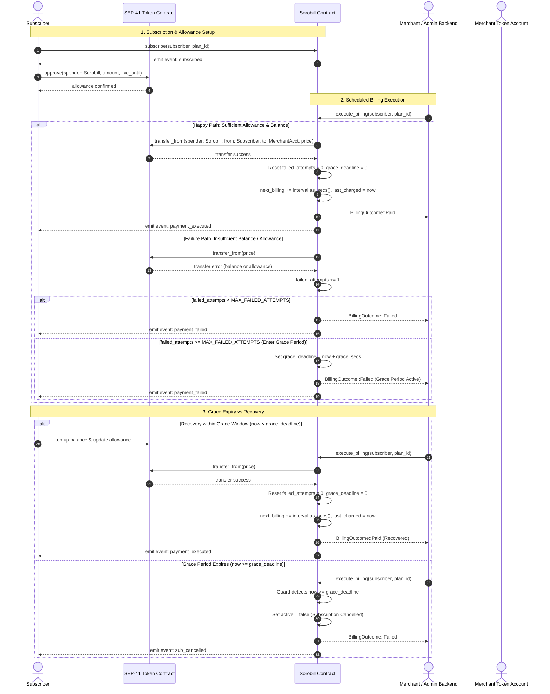

# Billing flow diagram

Visual companion to `BILLING_FLOW.md` detailing the Sorobill recurring subscription lifecycle.

## Mermaid Sequence Diagram

The following sequence diagram outlines the end-to-end lifecycle: subscription initialization, SEP-41 token allowance approval, scheduled `execute_billing` execution (happy path vs. failure path), grace period triggering, and recovery vs. automatic cancellation.



---

## ASCII Overview

```text
                    +------------------+
                    |  Admin backend   |
                    +--------+---------+
                             |
                             v
 +-----------+     +---------+----------+     +------------+
 | Subscriber|     | Sorobill contract  |     |  Merchant  |
 | allowance |---->| execute_billing    |---->|  receives  |
 +-----------+     |  - due?            |     |  tokens    |
                   |  - grace expired?  |     +------------+
                   |  - balance ok?     |
                   +---------+----------+
                             |
              +--------------+--------------+
              |                             |
              v                             v
        BillingOutcome::Paid      BillingOutcome::Failed
        next_billing += interval  failed_attempts++ / grace / cancel
```

## Decision order

1. **Auth check**: Caller must match contract admin address.
2. **Subscription status**: Subscription must exist, be active (`active == true`), and not paused (`paused == false`).
3. **Grace expiry check**: If `grace_deadline > 0` and `env.ledger().timestamp() >= grace_deadline`, subscription is cancelled (`active = false`, emits `sub_cancelled`) and returns `BillingOutcome::Failed`.
4. **Due date check**: If current timestamp `< next_billing`, aborts with error `BillingNotDue`.
5. **Token transfer & settlement**:
   - Calls `token_client.transfer_from(spender, subscriber, merchant, price)`.
   - On success: clears failure count and grace deadline, advances `next_billing`, emits `payment_executed`, and returns `BillingOutcome::Paid`.
   - On failure: increments `failed_attempts`, optionally initializes `grace_deadline`, emits `payment_failed`, and returns `BillingOutcome::Failed`.
